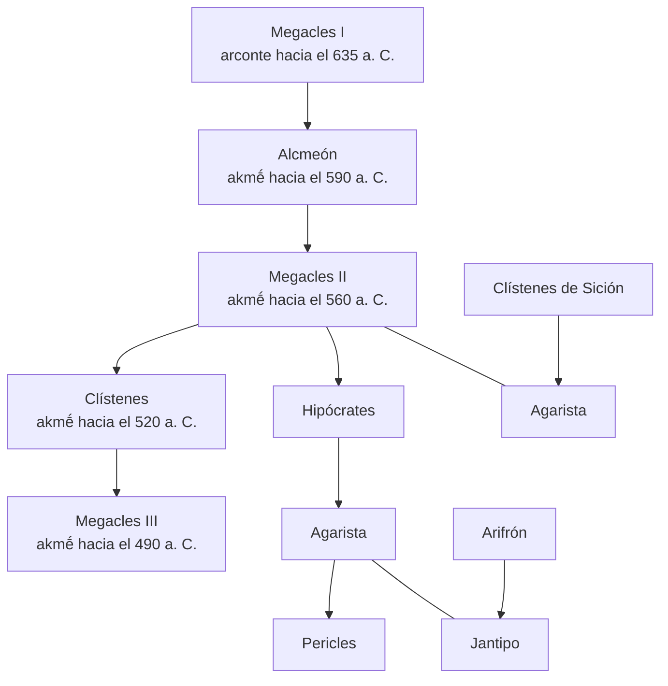

780. De las otras embajadas se habla más adelante. Cf. *infra*, I 139, 1-3. Las tres embajadas con la negativa de Atenas a dar satisfacción a las exigencias peloponesias servían para una mejor justificación de la guerra. Obedecían a la idea, expuesta por Arquidamo (cf. *supra*, I 81, 5), de evitar la responsabilidad inicial. En realidad no eran más que pretextos, tal como señala Tucídides.
781. La expresión es *tò ágos elaúnein*, en la que el término *ágos* se refiere tanto al acto sacrilego y a la contaminación que comporta como a los mismos sacrilegos, *enageîs*, responsables de la mancha. Literalmente significa «alejar la mancha», es decir, «expiar el sacrilegio» o «expulsar a los sacrilegos» (incluyendo a sus descendientes). Cf. *infra*, I 126, 12; 127, 1. En este caso se quería conseguir el destierro de Pericles, que era un Alcmeónida por parte de madre, ya que el arconte Megacles, de la familia de los Alcmeónidas, era responsable del sacrilego asesinato (cf. L. MOULINIER, «La nature et la date du crime des Alcméonides», *Revue des Études Anciennes 48* (1946), 182 ss. ).
782. Atenea. Cf. *infra*, n. 793.
783. Sobre este personaje, cf. HERÓDOTO, V 70-71; PLUTARCO, *Solón* 12. Fue vencedor en la carrera del doble estadio (*díaulos*) en la Olimpíada del 640 a. C. (cf. EUSEBIO, *Chronicorum libri* I 198; PAUSANIAS, I 28, 1). Su tentativa de establecer una tiranía en Atenas debió de tener lugar entre el 640 y el 630 a. C. De esta conspiración de Cilón (cf. M. LANG, «Kylonian conspiracy», *Classical Philology* (1967), 243 ss. ) Tucídides nos da una versión más detallada que Heródoto, quien, como dato cronológico, se limita a decirnos que ocurrió antes de la época de Pisístrato, sin mayor precisión.
784. Fue tirano de Mégara en la segunda mitad del siglo VII a. C. (del 640 al 620 aproximadamente). Cf. ARISTÓTELES, *Política* V 4, 5, 1305a; PAUSANIAS, I 28, 1; 40, 1, que se refiere a su matrimonio con la hija de Cilón. La tentativa debió de contar, por tanto, con el apoyo de Mégara.
785. La gran fiesta de Olimpia durante la que se celebraban las Olimpíadas. Probablemente se refiere a la del año 632 a. C. o a la del 628. Según el escoliasta, la precisión de que eran del Peloponeso se debe a que había otros lugares con el nombre de Olimpia. La fama de Olimpia y de sus fiestas, sin embargo, hacen que la indicación parezca superflua.
786. Era una fiesta anual que se celebraba en primavera, en el mes de antesterión (marzo-abril). Se realizaban ofrendas y había ceremonias nocturnas de carácter mistérico.
787. «Miliquio» (*Meilíchios*) significa «benigno», «benévolo» o «clemente». Era divinidad de la vegetación y dios purificador. Recibía culto en Atenas y en otras ciudades griegas.
788. Pasaje corrupto y problemático. Aceptamos la reconstrucción basada en una lectura del pasaje por parte de *Póllux* (I 26). La utilización de víctimas cruentas también está atestiguado (cf. ARISTÓFANES, *Nubes* 408; JENOFONTE, *Anábasis* VII 8, 4). Leemos *polloì*, según los manuscritos, sin aceptar la corrección de C. F. Hermann, que da *pollà*.
789. Desde antiguo, sólo parte de la población ateniense vivía en la ciudad propiamente dicha; una buena parte vivía diseminada en los campos del Ática. Esto era así en tiempos de Cilón y seguía ocurriendo en época de Pericles, como demuestra el relato del mismo Tucídides sobre lo que supuso para la población de Atenas el abandono de los campos al sobrevenir la guerra (cf. *infra*, II 14, 1-2; 16, 1-2).
790. Según HERÓDOTO (V 71, 2), a los *prítanes de los naucraros* o presidentes de las comisiones navales por distritos que, en aquella época y según Heródoto, gobernaban Atenas. Pero se sabe que esto no es cierto, y sin duda debe de tener razón Tucídides al atribuir la responsabilidad a los arcontes. Cf. B. JORDAN, «Herodotus V 71, 2 and the Naucraroi of Athens», *California Studies in Classical Antiquity* 3 (1970), 153-175. El pasaje de Tucídides probablemente pretende corregir el conocido texto de Heródoto, que, inspirándose en una fuente alcmeónida, intentaba sin duda borrar la responsabilidad de Megacles y su familia.
791. Plenos poderes para actuar libremente, pero que no les liberaban de la responsabilidad derivada de su actuación. Al incurrir en sacrilegio no involucraban en el *ágos* al pueblo de Atenas.
792. Con el nombre de *árchontes* se solía designar en Atenas a nueve magistrados (arconte epónimo, arconte rey, polemarco y seis tesmotetes), cuyos poderes se fueron reduciendo con el paso de la aristocracia a la democracia.
793. HERÓDOTO (V 71, I) dice «al lado de la imagen». Se trata del altar o la imagen de Atenea *Políade*, la «protectora de la ciudad». Atenea era venerada con esta advocación en el Erecteo, el templo más antiguo que tenía consagrado en Atenas, destruido más tarde por los persas (cf. HERÓDOTO, VIII 41, 2). Cuando los suplicantes se acogían a la protección de la divinidad, adquirían la inviolabilidad. Si esta inviolabilidad no era respetada, como en este caso, se caía en el sacrilegio.
794. Las Erinias, vengadoras de las asesinatos, convertidas en Euménides («Benignas») tras la reconciliación con Atenas, después de la absolución de Orestes (cf. PAUSANIAS, I 28, 6). Su santuario se encontraba al pie del Areópago, en el lado nordeste (cf. PAUSANIAS, VII 25, 2). En este caso el sacrilegio revestía aun mayor gravedad por cuanto se cometió al pie de los altares de estas diosas.
795. La responsabilidad recayó en el alcmeónida Megacles como arconte epónimo (cf. PLUTARCO, *Solón* 12, 1-2). Tucídides no menciona aquí directamente a los Almeónidas, pero el tema de su sacrilegio era universalmente conocido (cf. HERÓDOTO, V 71, 2). Además, en el capítulo siguiente (127, 1), se referirá a ello al decir que Pericles estaba implicado por la parte de su madre.
796. Según la tradición ática, esta primera expulsión de los Alcmeónidas ocurriría hacia el 594 a. C., en tiempos de Solón y una generación después de la tentativa de Cilón. De todas formas, la cuestión no está clara y a partir del relato de Tucídides podría entenderse que se produjo inmediatamente después de la conspiración y que los huesos no fueron desenterrados hasta la expulsión posterior (cf. A. W. GOMME, *op. cit.* I, págs. 427-428).
797. Hijo de Anaxándridas, de la familia de los Agíadas, fue rey de Esparta en los últimos años del siglo VI y primeros del V a. C., en un período en que Esparta era reconocida como la primera potencia de Grecia (cf. HERÓDOTO, III 148, 1; V 39; 41-42; 54; 64; 70; 72-76; 90; etc. C.). Fue llamado por Iságoras, arconte de Atenas en el 508, que era jefe de los aristócratas conservadores y rival de Clístenes, para que le ayudara frente a las reformas populares del Alcmeónida (cf. HERÓDOTO, V 66- 73). Cleómenes, que mantenía relaciones de hospitalidad con Iságoras (cf. HERÓDOTO, V 70, 1), intervino, pero, antes de su llegada, Clístenes abandonó Atenas. Volvió pronto, ya que el pueblo ateniense reaccionó contra Iságoras y sus partidarios, que se encerraron en la Acrópolis con los invasores espartanos.
798. Dentro de las tendencias aristocráticas, las diferencias entre Iságoras y Clístenes estribaban en el mayor impulso que este último daba a la evolución «popular» que la sociedad ateniense había experimentado durante la tiranía de los Pisistrátidas (que había acabado hacía poco, en el 510 a. C.). Iságoras era el jefe de la facción aristocrática conservadora y Clístenes de la reformista. Al triunfar Iságoras en las elecciones a arconte del 508-507, Clístenes reaccionó con sus reformas tendentes a modificar las instituciones, en un golpe de Estado «demagógico», lo que provocó la contrarreacción de los sectores más conservadores.
799. El exilio fue una experiencia repetida en esta importante familia de los Alcmeónidas. Del primer destierro (cf. *supra*, n. 796) regresaron en la misma época de Solón (como resultado de su política de reconciliación): Alcmeón, hijo de Megacles, mandaba las fuerzas atenienses en la Primera Guerra Sagrada hacia el 590 a. C. (cf. PLUTARCO, *Solón* 11, 2), y ya había vencido en las carreras de carros de las Olimpiadas del 592 (cf. HERÓDOTO, VI 125, 5; ISÓCRATES, S*obre el tronco de caballos* XVI 25; *escolio* a PÍNDARO, *Pílica* VII 14). Este Alcmeón, según afirma Heródoto, fue sumamente rico y en su época, debido a su fortuna, debió de generalizarse el nombre de la familia. Hijo suyo fue Megacles II, el que se casó con Agarista, la hija del tirano de Sición, Clístenes (cf. HERÓDOTO, VI 126-131). Este Megacles y su familia también conocieron el exilio tras acentuarse las diferencias entre Megacles y Pisístrato después de la segunda toma del poder por parte del tirano (cf. HERÓDOTO, I 64, 3; V 62, 2; VI 123, 1; P. J. BICKNELL, «The exile of the Alkmeonidai during the Peisistratid tyranny», *Historia* 19 (1970), 129 ss. ). Del matrimonio de Megacles y Agarista nació Clístenes el reformador, de cuyo breve destierro, después de caer la tiranía de Pisístrato, ya se ha hablado. Otro hijo de Megacles fue Hipócrates, padre de una segunda Agarista que contrajo matrimonio con Jantipo, matrimonio del que entre 495-490 a. C. nació Pericles. He aquí el árbol genealógico de esta poderosa familia:

800. Esparta se constituía en mantenedora del derecho sagrado, pero en realidad esgrimía un pretexto para desprestigiar a Pericles cuya política temía.
801. Agarista, sobrina de Clístenes y nieta de Megacles II. Cf. HERÓDOTO, VI 130-131; PLUTARCO, *Pericles* 33. Agarista, mientras estaba embarazada, creyó ver en sueños -según nos cuenta Heródoto- que paría un león.
802. La desgracia de pertenecer a la familia de los Alcmeónidas, la maldición que pesaba sobre él.
803. Cf. *infra*, I 139, 4; II 65, 9; PLUTARCO, *Pericles* 16, 1.
804. El promontorio más meridional del Peloponeso, situado en el extremo de la península central que separa los golfos de Mesenia y Laconia; es el actual cabo Matapán.
805. El culto de Posidón estaba muy extendido en las islas y en las zonas costeras, y muy especialmente en el Peloponeso. Su santuario del cabo Ténaro, situado frente a alta mar, era muy conocido. Gozaba del derecho de asilo. (Cf. *infra*, I 133; DIODORO, XI 45, 4; PAUSANIAS, IV 24, 5-6. ) 
806. Cf. *supra*, I 101, 2.
807. Literalmente «de la morada de bronce». El templo se encontraba en la «Acrópolis» de Esparta (cf. PAUSANIAS, III 17, 1-3; III 17, 2; X 5, 11); sobre su excavación, cf. *Annual of the British School at Athens* XIII (1906-7), págs. 137-154, XIV, 142-146. La denominación Calcieco ha sido diversamente interpretada; podría deberse al bronce del templo, de las puertas o de la techumbre, o al de la estatua de la diosa. Es probable, sin embargo, que refleje una antigua relación de época micénica entre Atenea y el gremio de los broncistas.
808. Cf. *supra*, I 95, 3. Para la segunda vez, cf. *infra*, I 131, 1.
809. Los espartiatas o los «pares» (*hómoioi*) eran los ciudadanos de pleno derecho en Esparta; aunque numéricamente eran inferiores a los periecos e hilotas (cf. *supra*, nn. 562 y 563), constituían el sector más importante del Estado espartano. Vivían de las propiedades cultivadas por los hilotas a su servicio y sus actividades eran esencialmente políticas y militares. Su educación ya estaba enfocada a formar este tipo de ciudadano-soldado que debía mantener el espíritu y el status social y político de Esparta.
810. Cf. *supra*, I 95, 5.
811. Cf. *supra*, I 95, 6.
812. Aqui Tucídides se refiere a la guerra contra Persia llamándola *tòn Hellēnikòn pólemon*, «guerra helénica», mientras que lo normal en otros pasajes (cf. *supra*, I 14, 2, n. 108; 23, 1, n. 158; 90, 1; 95, 7; 97, 1-2, etc. C.) es que la denomine *Mēdikòs pólemos o tà Mēdiká*. La expresión «guerra helénica» es utilizada incluso en otro pasaje para indicar la guerra entre griegos (cf. *supra*, I 112, 2: *kaí Hēllēnikoû mèn polémou éschon hoi Athēnaîoi*). Sin embargo, esto no es razón suficiente para una corrección, como quieren algunos (Gebhardt). En este pasaje la expresión obedece sin duda a un deseo de subrayar el contraste entre la declaración de querer combatir por la causa griega y el objetivo oculto de negociar con los persas para conseguir la sumisión de Esparta y de Grecia. Por otra parte, ya no era una guerra defensiva contra Persia, sino que era una guerra nacional griega, de iniciativa helénica.
813. En el 478 a. C. Cf. *supra*, I 94, 2.
814. Cf. *supra*, nn. 108 y 597.
815. Sobre este personaje y sus descendientes, cf. JENOFONTE, *Helénicas* III 1, 6; *Anábasis* VII 8, 8. A consecuencia de su traición, se refugió en Persia y fue recompensado por Jerjes con las rentas de algunas ciudades, igual que le ocurrió a Temístocles (cf. *infra*, I 138, 5).
816. Cf. *supra*, I 15.
817. Sobre esta carta, cf. P. J. RHODES, «Thucydides on Pausanias and Themistocles», *Historia* 19 (1970), 387 ss.
818. El *táde* que antecede al texto de la carta, que contrasta con el soiáde que precede a los discursos, ha hecho pensar que se trata de una transcripción literal, El problema se centra en torno a la dificultad de legar a conocer una carta de este tipo o a la existencia de una correspondencia falsificada de Pausanias con objeto de acusarlo. Se sabe que en aquella época la comunicación mediante un documento escrito no era frecuente; se acudía con preferencia a los mensajes orales. En este caso, sin embargo, tal vez se hizo aconsejable la carta secreta. Hay que pensar, por otra parte, que en casos como éste, mientras que Heródoto se basa en la tradición oral, Tucídides lo hace en testimonios literarios.
819. *Dorì helṓn*, expresión poética.
820. Hay un cambio de tercera a primera persona.
821. O «con una hija tuya», según el texto del manuscrito C. Según una tradición recogida por HERÓDOTO (V 32), Pausanias no aspiraba tan alto, sino que se comprometió con una hija de Megábates (persa *Bagapāta*), un noble persa primo de Darío, que no sabemos si es el mismo que aparece en el capítulo siguiente (129, I) como sátrapa de Dascilio.
822. Cf. HERÓDOTO, VII 28, 3; 44; VIII 69, 2; 101, 1; 103; IX 109, 1-2.
823. Uno de los personajes más ilustres del ejército de Jerjes que invadió Grecia. Demostró su talento militar al evitar que sus tropas sufrieran el desastre de las demás en la batalla de Platea (cf. HERÓDOTO, VII 66; VIII 126-129; IX 41-42; 66; 89).
824. Sobre la organización del Imperio persa en satrapías, provincias al frente de las cuales estaba un sátrapa (término procedente del persa *khshathrapavan*, «protector del reino»), cf. HERÓDOTO, III 89-97.
825. Satrapía del Asia Menor noroccidental; tomaba el nombre de la ciudad de Dascilio, su capital. Cf. HERÓDOTO, III 90, 2; JENOFONTE, *Helénicas* IV 1, 15-16. Comprendía los pueblos de la orilla asiática del Helesponto.
826. Cf. *supra*, I 128, 7, n. 821. Tucídides sólo lo menciona en este pasaje.
827. El sello real que llevaba la carta.
828. Cf. el comienzo de la carta de Darío a Gadatas en R. MEIGGS, D. LEWIS, *A selection of Greek Historical Inscriptions*, cit., n. 12, líns. 1-4. Se trata de un encabezamiento formular con función fática (cf. L. RUBIO, *Introducción a la síntaxis estructural del latín* I, Barcelona, 1966, págs. 20-21). Toda la carta, por otra parte, tiene un estilo oriental que le da, por lo menos, una apariencia de autenticidad.
829. Cf. la misma inscripción citada en la nota anterior, donde leemos una expresión muy semejante (cf. líns. 15-17). Seguramente era un registro que se materializaba. Cf. HERÓDOTO, VIII 85, 3, donde se nos dice que Filaco fue inscrito entre los benefactores del Rey, que le recompensó con tierras (*euergétēs basiléos anegráphē kaì chṓréi edōrḗthē pollêi*).
830. Otra fórmula habitual en los escritos de la corte persa. Cf. HERÓDOTO, V 23, 2, donde aparece una expresión semejante en unas palabras que Megabazo dirige a Darío.
831. Cf. HERÓDOTO, XI 10, 1; 64, 1; 76-88.
832. Como un monarca oriental.
833. Cf. *supra*, I 75, 2; 95, 1-7; HERÓDOTO, VIII 3, 2.
834. Cf. *supra*, I 95, 3.
835. Mandados por Cimón. La fecha no es segura; se sitúa entre el 476 y el 470 a. C.
836. Ciudad y región situadas al noroeste de Asia Menor.
837. Es decir «un mensaje secreto». La escítala (*skytálē*) era un bastón cilíndrico en torno al que se arrollaba oblicuamente una tira de papiro o de cuero donde se escribía el mensaje en sentido longitudinal de forma que sólo pudiera leerse con la tira arrollada en la escítala correspondiente. Luego se mandaba el mensaje sin el bastón. Antes de partir los generales o los embajadores con quienes los éforos querían estar en contacto, habían recibido de éstos una escítala idéntica a la que ellos se quedaban en su poder. Al recibir un mensaje, el destinatario lo arrollaba de nuevo en su bastón y podía leer el texto. Era el sistema normal utilizado por los éforos de Esparta para enviar mensajes secretos a quienes habían marchado en misión oficial. En este caso ha llamado la atención que Pausanias, que había partido de forma privada, estuviera en posesión de una escítala. Es probable que ello fuera debido a su condición de regente del rey Plistarco (cf. *infra*, I 132, 1). Sobre la escítala, Plutarco nos ha dejado una descripción muy detallada (cf. PLUTARCO, *Lisandro* 19, 8-12). El escoliasta de Tucídides también la describe. Se llama escítala tanto al bastón como a la tira que contenía el mensaje secreto, tal como vemos en este pasaje.
838. Hacia el 470, o algo más tarde.
839. Sobre el poder de los éforos, cf. *supra*, n. 466. Pausanias no era rey, sino regente. Cf. *infra*, I 132, 1; HERÓDOTO, IX 10, 1-2.
840. Cf. *supra*, I 95, 5.
841. Leónidas y Cleómbroto, padre de Pausanias, eran hermanos. Cf. *supra*, I 94, 1, n. 512. Plistarco fue rey desde el 480 hasta el 458 a. C.
842. Se llamaba trípode a un recipiente de metal sostenido por tres pies, hecho que explica su nombre. Este al que aquí se hace referencia era de oro y fue ofrecido a Apolo Pitio en recuerdo de la victoria de Platea. Propiamente su apoyo no eran tres pies, sino una columna de bronce dorado formada por tres serpientes que se entrelazaban, en las que estaban grabados los nombres de las ciudades que habían luchado contra los persas y que habían dedicado la ofrenda (cf. *infra*, I 132, 3; III 57, 2; HERÓDOTO, VIII, 82, I; R. MEIGGS, D. LEWIS, *op. cit.* 27). No se trataba de una serpiente de tres cabezas, como se desprende de HERÓDOTO, IX 81, 1. Se encontraba en Delfos, en el templo de Apolo Pitio, pero la parte de oro fue fundida por los focenses en la Guerra Sagrada del siglo IV (cf. PAUSANIAS, X 13, 9). El soporte todavia puede verse en Estambul; había sido trasladado por el emperador Constantino a Bizancio, donde fue descubierto en 1856.
843. Según PAUSANIAS, III 8, 2, fue compuesto para Pausanias por el poeta Simónides.
844. Se destacaba así el mérito colectivo evitando que el éxito personal sirviera para acrecentar el poder de Pausanias. Cf. ARISTÓTELES, *Política* V 6, 2 (1307a).
845. Tucídides no se responsabiliza aquí de todos los detalles. Ocurre lo mismo en I 134, 1, Cf. H. D. WESTLAKE, «Legetai in Thucydides», *Mnemosyne* 30 (1977), 345-362.
846. De Argilo, una ciudad de Calcídica oriental cercana a Anfípolis. Sobre ésta, cf. *supra*, I 100, n. 555. Se trataba probablemente de un esclavo (cf. *infra*, I 133).
847. Se insiste en la prudencia de los éforos, que exigían diversas pruebas antes de tomar aquella importante resolución. Más rápida parece luego la decisión ateniense respecto a Temístocles. Sería, pues, una manifestación más de la prudencia lacedemonia.
848. Claramente irónico.
849. Cf. *supra*, I 128, 2, n. 807.
850. DIODORO (XI 45, 6) cuenta una anécdota según la cual la madre de Pausanias fue la primera mujer en acudir con un ladrillo para tapiar las puertas.
851. Para evitar que, al morir dentro, profanase el santuario. Si le hubieran dejado morir en su interior, les hubiera acarreado el *ágos*, la culpa sacrilega para los responsables y la contaminación del lugar. La muerte de Pausanias se sitúa hacia el 470 o algo más tarde.
852. Un barranco o una profunda caverna cerca de Esparta donde los criminales eran arrojados. Se desconoce su ubicación. Cf. PAUSANIAS, IV 18, 4-7.
853. Según PAUSANIAS (III 14, 1), la tumba de Pausanias se encontraba junto a la de Leónidas, otro gran héroe de las Guerras Médicas.
854. Aún las vio Pausanias en el siglo II d. C. cerca del altar de la Calcieco (cf. PAUSANIAS, II 17, 7).
855. Como expiación por su muerte. Según el escoliasta, la exigencia de los dos cuerpos implicaba el sacrificio expiatorio de dos éforos, que fue evitado mediante la consagración de las dos estatuas.
856. Después de la digresión sobre Pausanias, un personaje controvertido del que Tucídides nos da una imagen negativa, comienza aquí otro *excursus* sobre Temístocles, otra gran personalidad, contemporáneo de Pausanias. Temístocles había sido condenado al ostracismo en el 471 y se encontraba en Argos al producirse la acusación de Esparta. La hostilidad espartana respecto a Temístocles obedecía sin duda a su política de potenciación de Atenas (cf, *supra*, I 89, 3-92) y a su actividad antiespartana, que seguía manifestándose en su exilio de Argos, enemiga de Esparta. En contraste con su visión de Pausanias, el juicio de Tucídides respecto a Temístocles será claramente positivo.
857. Ostracismo (término que deriva de *óstrakon*, el pedazo de vasija rota en el que se escribia el nombre de la persona a la que se quería enviar al exilio); los atenienses podían condenar al destierro durante diez años a un ciudadano considerado peligroso para Atenas. La institución del ostracismo es atribuida por ARISTÓTELES (cf. *Constitución de los atenienses* 22, 1) a Clístenes, mientras que otros (ANDROCIÓN y FILÓCORO, cf. F. JACOBY, F. *GrHist* 324, F 6 y 328 E 30, respectivamente) la consideran posterior. El sistema era el siguiente: una vez al año se tenía una asamblea para decidir si se debía proceder al ostracismo. En caso afirmativo, se reunía una segunda asamblea para votar a la persona que merecía el exilio. Para que la votación fuera válida debía haber, como mínimo, una participación de seis mil ciudadanos. La persona condenada al ostracismo seguía siendo ciudadano de Atenas y conservaba sus propiedades. Lo que se pretendía era alejarlo para evitar su participación en la vida política, con lo que se quería eliminar el riesgo de instauración de regímenes personales. Sin embargo, el sistema fue utilizado pos los partidos y facciones como instrumento de lucha política, para alejar a rivales molestos, prescindiendo de que aspirasen realmente a la implantación de un régimen tiránico. En este caso, Temístocles (cf. PLUTARCO, *Temístocles* 23, 1; 24, 6) fue enviado al exilio porque el favor popular se había inclinado hacia Cimón, que, a pesar de sus tendencias conservadoras, se había distinguido por sus victorias frente a Persia (cf. *supra*, n. 537). Aunque diversos autores consideraban el ostracismo simplemente como un sistema para prevenir que un hombre de Estado sobresaliente pusiera en peligro la Constitución, debía de comportar una dosis de deshonor, como prueban los mismos *ostraka*, en algunos de los cuales se añadían al nombre del hombre a quien se condenaba epítetos no precisamente elogiosos, tales como *prodótēs*, «traidor», *aleitḗr* «maldito», *ho Mêdos*, «Medo», etc. (cf. R. THOMSEN, *The origins of Ostracism*, Copenhague, 1972). El *dêmos* ateniense, además, era duro y llegaba a condenar a sus políticos por simples errores o a sus generales por no haber podido alcanzar la victoria o por un retraso sin culpa (cf. R. A. KNOX, «So mischievous a beaste? The Athenian demos and its treatment of its politicians», *Greece and Rome* 32 (1985), 132-161).
858. Su actividad en el Peloponeso fomentando desde Argos diversos movimientos antiespartanos, unida a la decisiva intervención que había tenido en la fortificación de Atenas (cf. *supra*, I 90, 3, n. 489), explican que Esparta, que antes lo habia admirado (cf. HERÓDOTO, VII 124), lo mirara como un peligroso enemigo.
859. En este episodio de la fuga de Temístocles, *polýtropos* como Ulises, Tucídides pone de manifiesto la inteligencia natural del personaje, la *sýnesis* elogiada en I 138, 1-2. Cf. G. MÉAUTIS, «Thucydide et Thémistocle», *L'Antiquité Classique *20 (1951), 297-304; P. HUART, *Le vocabulaire de l'analyse psychologique dans l'oeuvre de Thucydide*, París, 1968, pág. 283. En este caso, se puede considerar secundaria la exactitud histórica de los detalles de la aventura de Temístocles. Lo esencial es que define perfectamente el carácter del personaje. En este sentido, G. MÉAUTIS (art. cit., pág. 303) recordaba las palabras de Goethe a Eckerman: «Un hecho de nuestra vida tiene valor no en tanto que es verdadero, sino en tanto que significa algo».
860. El título de benefactor (*euergétēs*) era un título honorífico concedido por los Estados griegos a extranjeros beneméritos, o a otros Estados. No se conoce con seguridad la razón por la que Temístocles se había hecho acreedor de este título. Según el escoliasta, se debería a que habría evitado el castigo a Corcira por su neutralidad en las Guerras Médicas. Según PLUTARCO (*Temístocles* 24, 1), Temístocles habria favorecido a Corcira en un conflicto entre ésta y Corinto. Ambas explicaciones son problemáticas.
861. Pueblo cuyo territorio estaba en el interior del Epiro, a la altura de Corcira. Cf. *infra*, II 80, 6.
862. Sobre esta enemistad, cf. *infra*, 4; PLUTARCO, *Temístocles* 24, 2. Temístocles había tenido un papel decisivo en una respuesta negativa de Atenas a Admeto, que había solicitado alianza y ayuda. Así lo explica el escoliasta. No tenemos más noticias sobre ello.
863. Era una actitud solemne de súplica. Cf. *infra*, I 137, 1.
864. El Golfo Termaico. Era «el otro mar» respecto al mar Jonio que bañaba las costas del Epiro.
865. Cf. *supra*, I 61, 2, n. 349.
866. Por estar sometida a la autoridad de Alejandro I Filheleno, rey de Macedonia entre el 495 y 450 a. C., aproximadamente. Cf. *supra*, I 57, 2.
867. El rey de Persia (cf. *supra*, I 18, n. 132).
868. Un *holkás* o carguero. Cf. *supra*, n. 107.
869. Teniendo en cuenta que Artajerjes subió al trono a fines de diciembre del 465 a. C. (cf. *supra*, I 104, 1, n. 590), y que Temístocles se dirigió desde la costa hacia la corte persa cuando hacía poco que reinaba Artajerjes, según nos dice el mismo Tucídides (cf. *infra*, I 137, 3, n. 872), el hecho de que en su viaje a la costa asiática coincidiera con el asedio de Naxos se considera problemático, ya que en este caso, si el asedio se fecha hacia el 468 (cf. *supra*, I 98, 4, n. 544), Temístocles tendria que haber esperado tres años en Éfeso antes de escribir a Artajerjes. Para resolver este problema de una larga estancia en Éfeso, además de las propuestas de rebajar la fecha del asedio de Naxos, se ha pensado en la posibilidad de sustituir «Naxos» por «Tasos», que fue asediada en el período 465-463 a. C. (cf. *supra*, I 100, 2, n. 551; 101, 3), con lo que se suprimiría el problema de la larga detención en Éfeso. Esta corrección cuenta con el apoyo de un buen manuscrito de PLUTARCO (*Temístocles* 25, 2), que, citando a Tucídides, lee «Tasos» (a esta solución se opone F. J. FROST, «Thucydides I, 137, 2», *The Classical Review* 76 (1962) 15-16, basándose en importantes consideraciones sobre la navegación en el Egeo, que para la ruta Pidna-Éfeso llevan a pensar más en Naxos que en Tasos). Otras fuentes dan una solución diferente, ya que hacen llegar a Temístocles a la corte de Jerjes, no a la de Artajerjes, lo que demuestra que existía bastante confusión al respecto y explica esta imprecisión en la compleja cronología relativa a Temístocles (cf. A. W. Gomme, *op. cit.* I, págs. 398-399).
870. Colonia griega en la costa de Asia Menor, al norte de Mileto y del promontorio de Micale y bastante más al norte de Naxos; a su altura estaba Samos.
871. Cf. PLUTARCO, *Temístocles* 25, 3.
872. Existen dos tradiciones respecto al monarca que reinaba en Persia cuando hizo este viaje Temístocles. Unos (Carón de Lámpsaco, Aristodemo, Cornelio Nepote) concuerdan con Tucídides en cuanto a que era Artajerjes. Otros (Eforo, Dinón, Clitarco, Heráclides), en cambio, afirman que era Jerjes. Se da menos crédito a esta segunda tradición, atestiguada desde el siglo IV a. C., que tal vez había surgido con el propósito de conseguir que se volvieran a encontrar Temístocles y Jerjes, el vencedor y el vencido de la batalla de Salamina, lo que era de un efecto dramático indudable. (Cf. A. W. GOMME, *op. cit.* I, págs. 397- 399. ) 
873. Algunos han interpretado este pasaje como una referencia al relato de HERÓDOTO (VIII 75), según el que Temístocles, fingiendo que traicionaba a los griegos, dio el aviso a Jerjes de que la flota griega iba a retirarse, con lo que indujo a los persas a entrar en el estrecho entre Salamina y el Ática para bloquear a la flota griega (cf. *supra*, I 69, 5, n. 395), lo que en realidad supuso un gran engaño. Esta interpretación, sin embargo, no está de acuerdo con el sentido del pasaje ni con la afirmación de que Jerjes estaba en peligro, lo que no era cierto antes de la batalla de Salamina. Parece, por tanto, más probable otra interpretación según la cual Tucídides se refería a otro pasaje de HERÓDOTO (VIII 108-110) en el que Temístocles envía un mensaje a Jerjes animándolo a volver a su patria, dado que había logrado convencer a los griegos de no ir en su persecución y de no destruir los puentes construidos con embarcaciones sobre el Helesponto. En este caso se objeta que habría desacuerdo en cuanto a que este mensaje, según Heródoto, fue enviado desde Andros y no desde Salamina. Sin embargo, parece una objeción menor frente a las serias dificultades que se oponen a la primera interpretación. ¿Cómo iba a presentar Temístocles a su favor un mensaje del que había derivado una gravísima derrota para el destiatario?
874. Según HERÓDOTO (VIII 108, 2-4), Temístocles primero había sido partidario de perseguir a la flota persa y destruir los puentes del Helesponto, pero, ante la oposición de Euribíades y los peloponesios, había tenido que renunciar a su plan y, para granjearse entonces el favor persa, había enviado un mensaje a Jerjes en el que se atribuía el mérito de facilitarles la retirada, desaconsejando la persecución de la flota y la destrucción de los puentes (cf. HERÓDOTO, VIII 110, 3).
875. Tucídides no certifica la parte persa de la historia de Temístocles. Cf. *supra*, I 132, 5, n. 845.
876. En el sentido de que su inteligencia era innata.
877. Tucídides manifiesta claramente en este capítulo su admiración por Temístocles, de la que ya había dado pruebas en pasajes anteriores (cf. *supra*, I 14, 3; 74, 1; 90, 3; 93, 3). Es éste un elogio sin paliativos del talento de un hombre cuya personalidad aparece con claroscuros en otras fuentes. Heródoto concretamente, junto a una valoración positiva de sus dotes y de buena parte de su actividad, señala importantes aspectos negativos. Elogia, por ejemplo, su papel decisivo en la creación de una flota poderosa (VII 144), su talento de estratega, demostrado en su decisión de enfrentarse a los persas por mar (VII 143) y en el hábil planteamiento de la batalla de Salamina (VIII 74-76; 80). Como contrapartida destaca su avidez (VIII 111-112) o su tendencia a la corrupción (VIII 4-5) o una cierta predisposición a la traición (VII 107). Y, como Heródoto, otros historiadores, e incluso biógrafos como Nepote y Plutarco, van de los elogios a las críticas. Era natural que eso fuera así al tratarse de un hombre excepcional que no sólo estuvo en medio de las luchas políticas y rivalidades de Atenas, sino que, con su astucia en el asunto de la fortificación de Atenas y su actividad antilacedemonia, también se atrajo la decidida hostilidad de Esparta. Como hombre que unía la inteligencia a la acción, caracterizado por la *mêtis*, cual un Ulises de su época, su actuación suscitó críticas y elogios y se vio sin duda afectado por los intereses y la propaganda política. Frente a esta visión tradicional, Tucídides adopta una posición única. En su visión de Temístocles no hay sombras. A él se debe la liberación de Grecia frente a Persia y el poderío de Atenas. Incluso su huida a Persia merece disculpas: Temístocles fue víctima de la acusación interesada de Esparta y de la hostilidad de sus adversarios políticos de Atenas. Cf. A. J. PODLECKI, *The Life of Themistocles*, Montreal, 1975; «Themistocles and Pausanias» *Rivista di Filologia e d'Istruzione Classica* 104 (1976), 293-311; R. J. LENARDON, *The Saga of Themistocles*, Londres, 1978. Las críticas contra Temístocles son, pues, según Tucídides, fruto de intereses y rivalidades políticas, frente a las que están los hechos que atestiguan la incuestionable magnitud de este personaje tanto para Atenas como para toda Grecia (un hombre al que Ortega comparaba con César, las «dos cabezas claras del mundo antiguo»: cf. J. ORTEGA y GASSET, *La rebelión de las masas*, 13.ª ed., Madrid, 1956, pág. 158). Tucídides lo parangonaba sin duda a Pericles, la gran figura ateniense de su época.
878. La fecha de su muerte constituye un problema. Probablemente ocurrió entre el 460 y el 450 a. C.
879. Cf. ARISTÓFANES, *Caballeros* 83-84; DIODORO, XI 58, 3; PLUTARCO, *Temístocles* 31, 5. 6.
880. Ciudad situada al sudeste de Éfeso, entre ésta y Mileto y junto al río Meandro. Estaba en una excelente situación para intrigar con las ciudades de la Liga ático-delia, sobre todo con Mileto.
881. El pan era el alimento principal, lo que indica que Magnesia fue la sede de Temístocles, que acuñó moneda en ella. Estas expresiones alusivas a las contribuciones en especie son típicamente persas. Cf. HERÓDOTO, I 192, 3; II 98, 1; JENOFONTE, *Anábasis* 1 4, 9; PLATÓN, *Alcíbiades* I 123, b-c; A. T. OLMSTEAD, *A History of the Persian Empire*, Chicago, 1948, pag. 449.
882. Cf. *supra*, I 96, n. 531.
883. Ciudad estratégicamente situada en la costa asiática del Helesponto. Mientras que Magnesia suponía una donación real, dado que pertenecía a Persia, el caso de Lámpsaco y Miunte es problemático. Su pertenencia a la Liga ático-delia, con el pago de sus tributos a Atenas (hecho atestiguado desde el 450 aproximadamente), induce a pensar que se trataba de una donación nominal. Es posible, sin embargo, que durante los primeros años de la Liga dependieran realmente de Persia, por lo que no se descartaría una posesión efectiva por parte de Temístocles.
884. En este caso, el companaje (*ópson*; cf. el griego moderno *psári*, pescado) era básicamente pescado. DIODORO (XI 57, 7) dice del territorio de Miunte que tenía un mar rico en peces (*échousan thálattan euichthyn)*. Como las anteriores, es una expresión persa.
885. Ciudad situada a orillas del Meandro, al sudeste de Magnesia.
886. De forma tan secreta que Tucídides parece ponerlo en duda. Cf. PLUTARCO, *Temístocles* 32, 5-6.
887. Esta acusación ha motivado la indignación de algunos historiadores que, como Tucídides, consideran a Temístocles víctima de la ingratitud de las democracias con sus grandes hombres y de la hostilidad vengativa de Esparta.
888. Acaba aquí la digresión, que se inició en 126, 2, sobre la tentativa de Cilón y el sacrilegio de los Alemeónidas y sobre el sacrilegio del Ténaro. Este relato suele ser considerado como la parte más herodotea de Tucídides (cf. L. CANFORA, «Tucidide erodoteo», *Quaderni di Storia* 8 (1982), 77-84). No obstante, Tucídides lo ha planteado de forma original. Dos personajes ilustres, dos vidas paralelas, han sido contrapuestos (cf. H. KONISHI, «Thucydides 'method in the episodes of Pausanias and Themistocles», *American Journal of Philology* 111 (1970), 52-69), y Tucídides se ha decidido a favor de Temístocles, viéndolo sin duda como un símbolo de la Atenas que admiraba. A partir de 139, 1, reemprende el relato sobre las embajadas que había interrumpido en 126, 1.
889. Cf. *supra*, I 126, 1; 128, 1.
890. Exigencia difícilmente aceptable, como debían de saber muy bien los espartanos. Atenas había realizado un notable esfuerzo y estaba muy interesada en el asunto de Potidea. Cf. *supra*, I 64, 1-3.
891. Cf. *supra*, I 67, 2
892. Cf. *supra*, I 42, 2; 67, 4. Se ha dicho tradicionalmente que Tucídides, en su análisis de las causas de la guerra, subestima la importancia del decreto contra Mégara (cf. al respecto el importante trabajo de L. BODIN, «Autour du décret mégarien», *Mélanges littéraires de la Faculté des Lettres de Clermont-Ferrand*, 1910, págs. 169-182). Recientemente, sin embargo, esta importancia del decreto megareo como causa de la Guerra del Peloponeso ha sido devaluada por algunos investigadores, entre los que destaca G. E. M. de Ste. Croix, que con sus hipótesis al respecto ha provocado una polémica semejante a la que él mismo suscitó en el asunto de la popularidad o impopularidad del Imperio ateniense (cf. *infra*, 1I 63, 1, n. 402). G. E. M. DE STE. CROIX, en *The Origins of the Peloponnesian Wa*r, Londres, 1972, págs. 224-289, propone una reinterpretación radical del decreto megareo —del que no conocemos el texto más que por las referencias de autores como Tucídides y Aristófanes— en el sentido de limitar su importancia (en lo que está de acuerdo E. BAR-HEN, «Le décret mégarien», *Scripta Classica Israelica* 4 (1978), 10-27).
893. En los confines entre la Megáride y el Ática; estaba consagrada a las divinidades de Eleusis, Deméter y Perséfone (cf. HERÓDOTO, VI 75, 3).
894. El territorio sin delimitar (*aóristos*) era una especie de tierra de nadie en la frontera que debía de ser conflictivo. 
895. El problema de la acogida que Mégara daba a los esclavos fugitivos de Atenas es parodiado por ARISTÓFANES, *Acarnienses* 526-527. Vuelve a aparecer en el discurso de Pericles (cf. *infra*, I 142, 4). 
896. Puede ser el mismo que aparece en V 12-14, y el padre de Clearco (cf. *infra*, VIII 8, 2; 39, 2; 80, 1). 
897. Nuevamente enviado a Atenas el año siguiente (431 a. C.) en un último intento de obtener las satisfacciones que hubieran evitado la guerra (cf. *infra*, II 12, 1-4).
898. Tal vez el padre de Agesándridas que aparece en VIII 91, 2. 
899. Propuesta tan general como inaceptable; significaba un serio golpe para la política imperialista ateniense (cf. *infra*, I 144, 2, n. 936). Sólo puede entenderse un ultimátum de este tipo como una tentativa para que se aceptara negociar y se abordaran luego problemas concretos como ei del decreto contra Mégara. 
900. Se deduce de este pasaje que el decreto contra Mégara estaba en la mente de todo el mundo como cuestión esencial. Tal vez por ello Tucídides ha ahorrado comentarios al respecto. 
901. Cf. *supra*, I 127, 3.
902. Frente a la *diánoia* de los hombres, está la *týchē*, un factor irracional frente a la razón, pero este «azar», para quienes ven en Tucídides un racionalista, tiene un papel secundario respecto a la inteligencia. Cf. H. HERTER, «Freiheit und Gebundenheit des Staatsmannes bei Thukydides», *Rheinisches Museum* 93 (1950), 133-153; J. DE ROMILLY, «L'optimisme de Thucydide et le jugement de l'historien sur Péricles (II, 65)», *Revue des Études Grecques* 78 (1965), 557-575. Según otra valoración, la *týchē* sería un factor determinante en la obra tucididea. Cf. H. P. STAHL, *Thukydides. Die Stellung des Menschen im geschichtlichen Prozess*, Munich, 1966. Por un lado se subrayan los elementos racionalistas, por otro los factores trágicos e irracionales. 
903. Ésta es la idea básica de la argumentación de Pericles: Esparta ya no presenta quejas, sino órdenes; su ultimátum es inaceptable para un Estado que se precie. Cf. *infra*, I 140, 5; 141, 1; 144, 2; 145. CF., asimismo, PLUTARCO, *Pericles* 31, 1. 
904. Esto es precisamente lo que decían los enemigos de Pericles. Cf. PLUTARCO, *Nicias* 9, 9; *Pericles* 31, 1-2. 
905. Desde este punto hasta 144, 1, Pericles hace un analisis de las fuerzas y de la disposición de los dos bandos, de las del enemigo en 144, 1-143, 2, y de las de Atenas en 143-3-144, 1. Todo el pasaje supone una contestación a los argumentos de los corintios (cf, *supra*, I 121-122)
906. Cf. *supra*, I 121, 2.
907. Son *autourgoí*. La economía peloponesia se basaba en la agricultura, aunque los ciudadanos de Esparta no se dedicaran a ella directamente (cf. *supra*, I 101, 2, n. 562; 128, 3). Cf. *infra*, I 142, 7: *geōrgoí*. Muchos ciudadanos atenienses se podían definir, asimismo, como *autourgoí* (cf. EURÍPIDES, *Orestes* 920), en el sentido de que vivían de su trabajo y de sus tierras. El Estado ateniense, sin embargo, gracias al imperio, tenía más medios financieros y mayor capacidad de abastecimiento desde el exterior, era menos dependiente de la producción interior (cf. *infra*, І 143, 4; IІ 13, 3). 
908. A causa de la enorme superioridad de la flota ateniense. 
909. La producción anual podía resultar suficiente en tiempo de paz; pero para la guerra eran necesarias reservas financieras (cf. *infra*, II 13, 3). En el caso de los peloponesios, ni los Estados ni los individuos disponían de estas reservas; tenían una economía sin excedentes. La guerra les suponía, por tanto, un esfuerzo enorme. Así lo veía Pericles.
910. A consecuencia de su limitación financiera, a los peloponesios les estaban vedadas las guerras de larga duración y con campos de batalla alejados, lo mismo que antes (141, 4) ha dicho respecto al mar. Por esta razón, los corintios (cf. *supra*, I 121, 3) propusieron la utilización de los tesoros de Delfos y de Olimpia para equipar una flota con la que poder enfrentarse a los atenienses, lo que realmente no se logró hasta que no contaron con el apoyo económico de los persas. 
911. Atenas, en cambio, decidía por sus aliados.